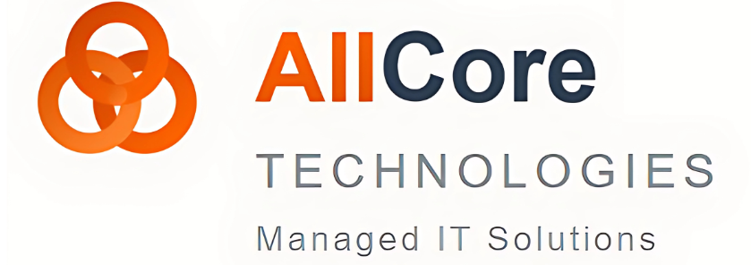

# Broadcast Foundations for AllCore Technologies

> Pre-meeting handout for AllCore Technologies (MSP) — partnership conversation.
> Reader: Doug Becker, President of AllCore Technologies. Their clients are ~100-employee SMBs.
> Goal: book a partnership demo with Marc Fregoe; AllCore introduces Broadcast Foundations to their customer base.
> Context: met Doug at the AI Demo Show and Tell event. Warm intro, evaluating partnership fit.
> Slug: allcore-msp-premeeting | Date: 2026-05-22
> Recipe: Sales leave-behind hybrid (hero-compact co-branded → number-row → feature-grid.cols-2 → callout-card → cta-strip → footer)
>
> **Remediation applied during render (2026-05-22):** Initial verify gate flagged a 398px footer overrun. Resolved with: (1) Tier A `--body-size:14px` (floor) on the .page div; (2) hero compacted to a single inline row (Cerkl lockup + divider + 22px H1 + AllCore logo right) instead of stacked column with separate lead paragraph; (3) feature-grid cell bodies trimmed from 50–85 words to ~35–45 words each; (4) number-row .sub lines trimmed to ~9–10 words; (5) cta-strip pitch and stat-panel body tightened; (6) removed "Source: …" line from footer addr. Second pass: PASS.

---

<!-- component: hero-compact (co-branded, two-logo variant) -->
<!-- Layout: Cerkl Broadcast lockup top-left, AllCore Technologies logo top-right, with a horizontal divider rule below, then H1 underneath. Render as:
     

       
       
     

     <h1 style="font-size:32px; color:var(--accent-dark); margin:14px 0 0; letter-spacing:-0.01em;">Broadcast Foundations for AllCore Technologies</h1>
-->

**Cerkl Broadcast wordmark (left, 160px medium):** `../../../branding-assets/Broadcast/Cerkl Broadcast Horizontal Lockup/Medium (160px)/cerkl_broadcast_horizontal_lockup_full_color_medium.png`

**AllCore Technologies logo (right, ~32px tall):** `../../assets/allcore-logo.png`

# Broadcast Foundations for AllCore Technologies

A free, purpose-built internal-comms platform you can hand to AllCore clients on day one.

<!-- component: number-row.cols-3 -->
<!-- Each cell: .num-cell with .big (stat), .lbl (label), .sub (description). -->
<!-- Lead with the price + scale story that resonates for an MSP recommending tools to ~100-employee clients. -->

**Cell 1 — variant: ruby**
- **big:** $0
- **lbl:** Free forever — no card, no contract
- **sub:** Foundations is the no-procurement starting point AllCore clients can adopt the day they need it.

**Cell 2 — variant: default (cobalt)**
- **big:** 5,000
- **lbl:** Emails per month, included
- **sub:** Comfortably covers a 100-employee org's internal-comms volume with room to grow.

**Cell 3 — variant: violet**
- **big:** 6M
- **lbl:** Employees reached monthly on Broadcast
- **sub:** The platform AllCore clients adopt is the one already reaching nearly six million employees.

<!-- component: feature-grid.cols-2 -->
<!-- 4 cells × 50–85 words each. Each cell: ✓ icon + h4 + body paragraph. -->
<!-- Curated for what matters when an MSP recommends a comms tool to a ~100-person client: deliverability, simple admin, measurable, IT-safe. -->

**Cell 1 — h4: Purpose-built internal email**
Drag-and-drop email builder pre-tested on 60+ email clients — no broken layouts in Outlook or Gmail, which Foundations was specifically built to replace. Sending speed of 25,000 emails per minute means even an all-staff blast lands in seconds. Pre-made templates, branded design, retargeting, and translation in 133 languages are all included.

**Cell 2 — h4: Audience Manager without IT tickets**
Live audience segmentation by role, location, department, or any HRIS field. Foundations supports HRIS sync (Workday, ADP, Paycor, Active Directory and more), manual CSV uploads, or rule-based segments — so the person owning comms at an AllCore client can target the right group themselves, without putting another ticket on the MSP queue.

**Cell 3 — h4: Real read analytics + pulse surveys**
Open rates, click data, and timestamped read receipts on every blast — the metrics nobody gets from Outlook or Gmail. Embedded pulse surveys and one-click acknowledgments give clients a feedback loop on policy rollouts, all-hands recaps, and culture moments. Foundations Insights makes it easy to show comms are landing.

**Cell 4 — h4: IT-grade security at $0**
SOC 2 Type II, GDPR, CCPA/CPRA, WCAG 2.1 Level AA. AES-256 encryption at rest, TLS 1.2+ in transit, OWASP-aligned vulnerability scanning. SSO (Okta, Azure AD, Google Workspace) available as an add-on on Foundations and included on paid tiers. An IT partner can recommend Broadcast without an architecture review.

<!-- component: callout-card.violet -->
<!-- Quote ≤25 words + attribution ≤8 words. Frames the MSP partnership thesis. -->

> A free, secure, purpose-built tool you can hand AllCore clients on day one — with a real upgrade path when complexity shows up.

— The Cerkl × AllCore partnership thesis

<!-- component: cta-strip -->
<!-- pitch (left): h3 ≤6 words, body 35–55 words. stat-panel (right, ruby): stat ≤4 chars + label ≤14 words + body 20–40 words. -->

### Book a partnership call

Walk through Foundations with our team, map it to AllCore's client base, and leave with the materials to introduce it confidently. Marc Fregoe handles partnership conversations — pick a time that works for you and Doug at [meetings.hubspot.com/marc-fregoe/time-with-marc](https://meetings.hubspot.com/marc-fregoe/time-with-marc).

**Stat panel (ruby):**
- **Free**
- Foundations forever — no card, no contract, no setup fees
- Everything in this brief is available at $0 today. The partnership call is the bridge from evaluating Broadcast to handing it to a first AllCore client.

<!-- component: footer -->
**Wordmark (footer, 80px small):** `../../../branding-assets/Broadcast/Cerkl Broadcast Horizontal Lockup/Small (80px)/cerkl_broadcast_horizontal_lockup_full_color_small.png`

Book at [meetings.hubspot.com/marc-fregoe/time-with-marc](https://meetings.hubspot.com/marc-fregoe/time-with-marc) · Cerkl Broadcast
